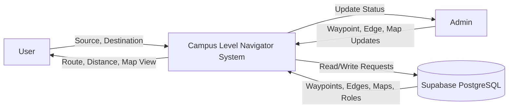
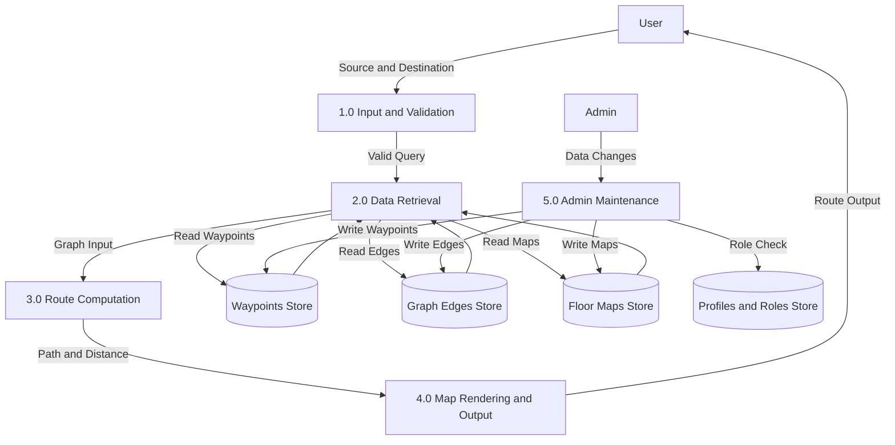
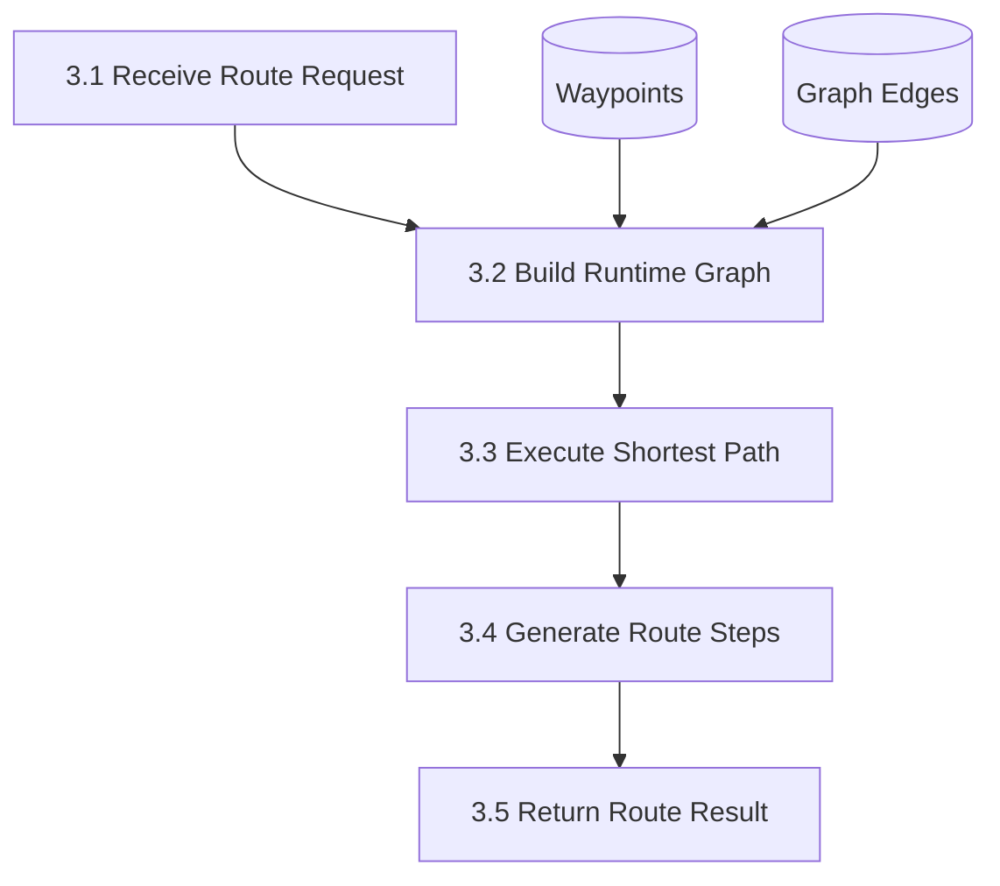
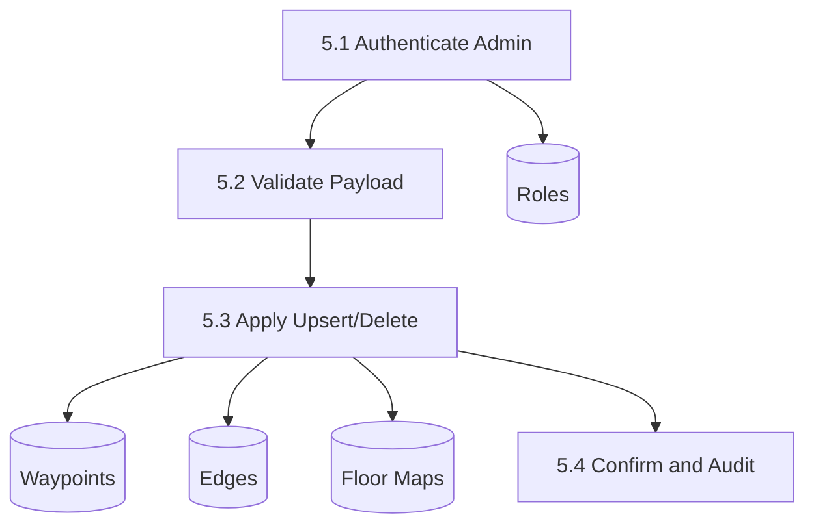
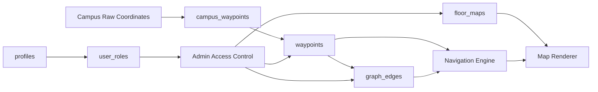

# CAMPUS LEVEL NAVIGATOR
## Final Project Documentation (Extended Version)

## Abstract
Campus Level Navigator is an indoor guidance platform designed for educational institutions with multi-floor, multi-block infrastructure. The project addresses a common practical issue in campus environments: users are unable to quickly identify exact room locations and route connections between administrative offices, labs, auditoriums, and service areas. The system provides digital, floor-aware route guidance through a waypoint-graph model where each location is represented as a node and valid movement paths are represented as weighted edges.

The solution uses a modern web architecture with React, TypeScript, Supabase, and PostgreSQL. The backend stores waypoint data, graph edge data, and map metadata, while the frontend computes and displays the shortest route with visual overlays. Role-based access and policy-level protections are implemented through Row Level Security (RLS), allowing public navigation read access and restricted write operations for admins.

This extended document is prepared in long-form style so it can be used as a major-project report. It includes complete chapter organization, detailed technical explanation, design decisions, logic used, module-level behavior, and Mermaid-based Data Flow Diagrams.

## 1. Introduction
Institutions with large infrastructure face a navigation challenge due to repeated room naming patterns, floor-wise segregation, and disconnected movement pathways between blocks. New students, first-time visitors, and event attendees often spend unnecessary time locating destinations. Existing physical boards and static maps are insufficient for dynamic, precise, and shortest-route guidance.

Campus Level Navigator was developed as an indoor routing platform that accepts source and destination waypoints, computes a route using graph logic, and presents the output on a floor map interface.

### 1.1 Organization Profile
The project context is an academic campus environment with the following characteristics:

- Multiple departments and blocks
- Ground and upper floors with distinct room positions
- Frequent student/visitor movement
- Administrative and academic locations distributed across map regions
- Need for centralized digital navigation support

Organizational goals supported by this solution:

- Improved user experience for navigation
- Reduced dependency on manual guidance
- Faster orientation for newly admitted students
- Easier management of navigation data through backend storage
- Foundation for future smart-campus services

### 1.2 System Specification

#### 1.2.1 Hardware Specification
Recommended deployment and usage hardware:

- Processor: Intel i3/i5 or equivalent
- RAM: 4 GB minimum, 8 GB recommended
- Storage: 1 GB free for project and local dependencies
- Display: 1366x768 or higher
- Network: Broadband or reliable Wi-Fi for cloud backend access

For development:

- Processor: Intel i5 or above preferred
- RAM: 8 GB or above
- SSD recommended for faster npm installs/build

#### 1.2.2 Software Specification
Development and runtime software stack:

- Operating System: Windows 10/11, Ubuntu, or macOS
- Runtime: Node.js LTS
- Package Manager: npm
- Frontend Framework: React with TypeScript
- Build Tool: Vite
- Styling: Tailwind CSS
- Backend-as-a-Service: Supabase
- Database: PostgreSQL
- Editor: Visual Studio Code
- Browser: Chrome/Edge/Firefox latest
- Testing Utilities: Vitest and Playwright

## 2. System Study

### 2.1 Existing System
The existing navigation process in many campuses is manual and static. Common practices include:

- Asking security personnel or staff
- Using printed maps at entrances
- Following directional boards in corridors
- Trial-and-error movement through floors

#### 2.1.1 Drawbacks

- No algorithmic shortest-path support
- Static boards cannot adapt to changes quickly
- Visitors struggle with building naming conventions
- No route personalization from exact source to destination
- Difficult to maintain consistency across all campus sections
- No centralized historical or auditable route data

#### 2.1.2 Problem Definition
The institution requires a digital platform that:

- Stores all significant locations as machine-readable points
- Supports route selection between any two points
- Provides shortest or near-optimal movement guidance
- Displays route context over floor map visuals
- Allows authorized data updates without code changes

### 2.2 Proposed System
The proposed platform is a graph-based indoor navigation system.

- Each location is represented as a waypoint
- Each traversable connection is represented as an edge
- Edge weights represent travel distance/cost
- Route computation identifies least-cost path

#### 2.2.1 Objective

- Deliver reliable indoor route guidance
- Improve accessibility for new and visiting users
- Provide scalable architecture for future floors/blocks
- Enable backend-driven updates without UI redesign
- Maintain secure data modifications through role controls

#### 2.2.2 Features

- Waypoint-based routing
- Floor map rendering
- Data fallback to seed set when backend is empty
- Floor and block-aware map retrieval
- Admin-restricted data writing
- Public read access for navigation users
- Modular code organization for maintainability

#### 2.2.3 Modules

- Navigation Interface Module
- Route Engine Module
- Data Access Module
- Map Rendering Module
- Security and Access Control Module
- Admin Maintenance Module

Module Description:

Navigation Interface Module:
- Collects source and destination
- Triggers route generation
- Presents route and distance outputs

Route Engine Module:
- Builds runtime graph in memory
- Computes shortest path using weighted graph logic
- Produces ordered nodes and travel instructions

Data Access Module:
- Reads waypoints, edges, and floor maps from Supabase
- Handles asynchronous loading and fallback behavior

Map Rendering Module:
- Loads relevant floor image
- Draws route overlays and point markers
- Supports floor-specific interpretation of coordinates

Security and Access Control Module:
- Enforces role-based write permissions
- Exposes read-only access for navigation users

Admin Maintenance Module:
- Maintains waypoint/edge/map dataset
- Ensures route graph remains valid after updates

#### 2.2.4 Functional Requirements

Core requirements:

- Accept valid source and destination waypoints
- Retrieve required graph and floor map data
- Compute shortest path on loaded graph
- Render path over corresponding map
- Support waypoint type and floor metadata

Administrative requirements:

- Admin can insert/update/delete waypoints
- Admin can insert/update/delete graph edges
- Admin can manage floor map references

Security requirements:

- Non-admin users must not edit core navigation data
- Public users must still be able to search and navigate

Performance requirements:

- Navigation query should respond quickly for regular graph sizes
- UI should remain responsive during async data operations

## 3. System Design and Development

### File Design
A modular folder strategy is used for separation of concerns.

Application-level folders:

- src/pages: route-level UI pages
- src/components: reusable visual and interaction components
- src/hooks: stateful logic and data access hooks
- src/lib: core graph logic, types, utilities
- src/integrations/supabase: client and DB typing
- supabase/migrations: schema and seed scripts
- public/floor-maps: map image assets

Design rationale:

- Better maintainability
- Easier debugging and testing
- Future admin panel and analytics integration possible

### Input Design
Input classes in the system:

User inputs:

- Source waypoint name/id
- Destination waypoint name/id
- Optional floor/block context

Admin inputs:

- New waypoint name, coordinates, type, floor, block
- Edge definitions between valid node pairs
- Floor map image URL metadata

Validation strategy:

- Prevent empty source/destination
- Prevent source=destination route ambiguity
- Enforce enum-based type values
- Enforce floor constraints through DB type

### Output Design
Main outputs generated:

- Path sequence
- Total route distance
- Map-highlighted route
- Floor-specific navigation context

Output quality goals:

- Clarity for first-time campus users
- Stable rendering across map sizes
- Predictable path behavior for repeated queries

### Database Design
The database follows relational modeling with policy controls.

Principal tables:

- profiles
- user_roles
- waypoints
- graph_edges
- floor_maps
- campus_waypoints (seed/source coordinate set)

Key constraints:

- waypoints: unique (name, floor)
- graph_edges: unique (from_node, to_node)
- enum restrictions for floor and waypoint type

Data security:

- RLS enabled on all critical tables
- Policy split for read vs write access
- Role function used for admin checks

### System Development
Development lifecycle adopted:

1. Requirement collection and campus route mapping.
2. Waypoint and edge model definition.
3. Frontend baseline with map components.
4. Backend schema with enum types and constraints.
5. Data hooks integration and graph loading.
6. Route engine wiring and output rendering.
7. Security policy setup and testing.
8. Migration-based seed loading for baseline dataset.
9. Functional and integration testing.

### Description of Modules (Detailed Explanation)

#### Module 1: Navigation Interface
Responsibilities:

- Accept route request inputs
- Validate basic form conditions
- Trigger route calculation
- Display route feedback

Design details:

- Built with React components
- Uses hooks for state and asynchronous data
- Keeps user flow minimal for quick route access

#### Module 2: Navigation Data Hook
Responsibilities:

- Fetch rooms/waypoints/edges/maps from backend
- Maintain loading and fallback behavior
- Build runtime graph nodes/edges for route engine

Design details:

- Async parallel loading for faster startup
- Uses seed fallback when DB records are unavailable
- Converts backend payload into in-memory navigation model

#### Module 3: Route Engine
Responsibilities:

- Hold graph nodes and adjacency relationships
- Compute shortest path between source and destination
- Return route plus distance and steps

Logic details:

- Weighted graph traversal
- Distance accumulation from edge weights
- Deterministic path generation for same input set

#### Module 4: Floor Map Module
Responsibilities:

- Resolve map URL by floor and block
- Normalize storage/static paths
- Render route coordinates over selected map

Visual details:

- Route overlays match stored coordinate system
- Fallback static maps used when DB map is absent

#### Module 5: Security Module
Responsibilities:

- Restrict write operations to admin role
- Allow public read for navigation consumption

Implementation details:

- RLS enabled on tables
- Policy-based authorization
- has_role function for role checks

#### Module 6: Migration and Seed Module
Responsibilities:

- Version-controlled schema changes
- Repeatable seed insertion
- Upsert behavior for safe reruns

Outcome:

- Consistent DB structure across environments
- Minimal manual setup for deployment

## Logic Used in the Project

### 3.1 Core Routing Logic
The system models the campus as a weighted graph G(V, E), where:

- V = set of waypoints
- E = set of traversable edges

Each edge contains a distance value. The shortest route problem is solved by least cumulative weight traversal.

### 3.2 Why Waypoint-based Design
Waypoint modeling supports:

- Rooms as direct endpoints
- Corridors as connectors
- Stairs/lifts as floor-transition anchors
- Expandable topology without redesign

### 3.3 Pathfinding Steps

1. Source and destination nodes selected.
2. Runtime graph built from waypoints and graph_edges.
3. Traversal starts from source.
4. Neighbor costs are accumulated.
5. Minimum-cost path to destination is resolved.
6. Ordered node list returned.
7. UI converts list into map overlay and user-readable steps.

### 3.4 Logic for Block Inference
During seed import, block assignment can be inferred from x-coordinate ranges:

- x <= 250 -> A
- x <= 430 -> B
- x <= 620 -> M
- x <= 790 -> C
- else -> D

This helps auto-classification when explicit block values are not given.

### 3.5 Logic for Empty Database Case
If backend data is absent:

- System enters fallback mode
- Seed nodes and edges are loaded in-memory
- User still receives route functionality

This avoids a blank or non-functional UI during initial deployment.

## Tech Stack (Detailed Explanation)

### 1. Frontend Stack

React:
- Component-driven UI architecture
- Strong ecosystem for reusable map and form controls

TypeScript:
- Compile-time type safety
- Clear interface contracts for DB objects and route data

Vite:
- Fast dev startup
- Lightweight build pipeline

Tailwind CSS:
- Utility-first styling
- Rapid interface iteration without large CSS files

### 2. Backend and Data Stack

Supabase:
- Hosted PostgreSQL with API layer
- Authentication support
- Policy control via RLS

PostgreSQL:
- Strong relational consistency
- Constraints, enums, and transaction support
- Suitable for structured navigation topology

### 3. Quality and Testing Stack

Vitest:
- Unit testing for utility and routing functions

Playwright:
- End-to-end browser flow testing

ESLint:
- Static analysis and code quality

### 4. Why this Tech Stack is Suitable

- Fast for development and deployment
- Strong type safety reduces runtime errors
- Easy backend administration and policy management
- Scales to larger campus graphs

## 4. Testing and Implementation

### 4.1 Testing Strategy

Unit testing:

- Graph utility behavior
- Input validation functions
- URL normalization logic

Integration testing:

- Hook + component interaction
- Data loading + graph construction flow
- Route request to route render pipeline

Manual testing:

- Known source-destination pairs
- Edge cases for unreachable node
- Fallback mode behavior

### 4.2 Test Case Samples

Case 1:
- Input: Source A Block 3, Destination Lab 1
- Expected: Valid route path and distance

Case 2:
- Input: Source equals destination
- Expected: Immediate or zero-distance behavior

Case 3:
- Input: Invalid destination name
- Expected: Validation or graceful error state

Case 4:
- DB empty
- Expected: Seed fallback navigation available

### 4.3 Implementation Procedure

1. Install dependencies.
2. Configure environment variables.
3. Run Supabase migrations.
4. Seed waypoint data.
5. Start frontend app.
6. Validate routes visually and functionally.
7. Verify admin write and public read policy behavior.

### 4.4 Deployment Notes

- Ensure production Supabase URL and anon key are configured.
- Ensure map URLs are publicly accessible.
- Keep migrations versioned and ordered.
- Review RLS policies before go-live.

## 5. Conclusion
Campus Level Navigator provides a structured and practical indoor guidance mechanism. By modeling locations as waypoints and movement as weighted edges, the platform offers accurate route computation and clear floor-map visualization. The architecture is modular, secure, and extensible for future additions such as corridor optimization, dynamic rerouting, crowd-based delay estimation, and mobile-first interfaces. The project demonstrates both software engineering quality and real-world campus utility.

## Bibliography

- React Documentation. https://react.dev/
- TypeScript Documentation. https://www.typescriptlang.org/
- Supabase Docs. https://supabase.com/docs
- PostgreSQL Documentation. https://www.postgresql.org/docs/
- Vite Documentation. https://vitejs.dev/
- Tailwind CSS Documentation. https://tailwindcss.com/docs
- Playwright Documentation. https://playwright.dev/
- Vitest Documentation. https://vitest.dev/

## Appendices

## A. Data Flow Diagram (Mermaid)

### A.1 Context Level DFD (Level 0)



### A.2 DFD Level 1



### A.3 DFD Level 2 (Route Computation Decomposition)



### A.4 DFD Level 2 (Admin Maintenance Decomposition)



## B. Table Structure

### B.1 Table Structure Visualization (Mermaid ER Diagram)

```mermaid
erDiagram
	AUTH_USERS {
		UUID id PK
		TEXT email
		TEXT password_hash
		TIMESTAMPTZ created_at
	}

	PROFILES {
		UUID id PK
		UUID user_id UNIQUE
		TEXT display_name
		TEXT avatar_url
		TIMESTAMPTZ created_at
		TIMESTAMPTZ updated_at
	}

	USER_ROLES {
		UUID id PK
		UUID user_id
		APP_ROLE role
	}

	WAYPOINTS {
		UUID id PK
		TEXT name
		FLOOR_TYPE floor
		REAL x
		REAL y
		WAYPOINT_TYPE type
		TEXT block
		TIMESTAMPTZ created_at
	}

	GRAPH_EDGES {
		UUID id PK
		TEXT from_node
		TEXT to_node
		REAL distance
		FLOOR_TYPE floor
		BOOLEAN is_vertical
		TIMESTAMPTZ created_at
	}

	FLOOR_MAPS {
		UUID id PK
		FLOOR_TYPE floor
		TEXT block
		TEXT image_url
		TIMESTAMPTZ uploaded_at
		TIMESTAMPTZ created_at
		TIMESTAMPTZ updated_at
	}

	CAMPUS_WAYPOINTS {
		BIGINT id PK
		TEXT name UNIQUE
		REAL x
		REAL y
		TIMESTAMPTZ created_at
	}

	AUTH_USERS ||--|| PROFILES : owns_profile
	AUTH_USERS ||--o{ USER_ROLES : has_roles
	PROFILES o|--o{ USER_ROLES : role_context
	CAMPUS_WAYPOINTS ||--o{ WAYPOINTS : seeds
```

Note: `AUTH_USERS.password_hash` represents hashed password storage (never plain-text passwords).

### B.2 Table Usage Flow (Mermaid)



### B.3 User-Friendly Explanation

The database has six main tables. Each table has a specific role in the navigation system.

profiles:
- Stores user profile details.
- One profile belongs to one authenticated user.
- Used for display information and account context.

user_roles:
- Stores access role for users (admin or user).
- Decides who can edit navigation data.
- Connected to profiles through user identity.

waypoints:
- Main navigation node table.
- Every room, corridor point, stairs, or landmark is stored here.
- Coordinates x and y are used to draw points on floor maps.

graph_edges:
- Stores connection lines between waypoints.
- from_node and to_node define the path link.
- distance is used by shortest-path logic.

floor_maps:
- Stores map image metadata for each floor/block.
- UI reads this table to load the correct map background.

campus_waypoints:
- Source/import table for raw campus coordinate points.
- Used to seed or sync entries into waypoints.
- Helpful when bulk loading room points.

Primary tables and columns summary:

1. profiles
- id (UUID, PK)
- user_id (UUID, unique)
- display_name
- avatar_url
- created_at
- updated_at

2. user_roles
- id (UUID, PK)
- user_id (UUID)
- role (admin/user)

3. waypoints
- id (UUID, PK)
- name (TEXT)
- floor (ENUM)
- x, y (REAL)
- type (ENUM)
- block (TEXT)
- created_at

4. graph_edges
- id (UUID, PK)
- from_node
- to_node
- distance
- floor
- is_vertical
- created_at

5. floor_maps
- id (UUID, PK)
- floor
- block
- image_url/blueprint_url
- uploaded_at
- created_at
- updated_at

6. campus_waypoints
- id (IDENTITY, PK)
- name (unique)
- x, y
- created_at

## C. Sample Coding

Shortest path (conceptual pseudocode):

```text
function findRoute(source, destination, graph):
	create minPriorityQueue
	set distance[source] = 0
	set all other distance = infinity
	push source into queue

	while queue not empty:
		current = node with smallest distance
		if current == destination:
			break

		for each neighbor in graph[current]:
			newCost = distance[current] + edgeWeight(current, neighbor)
			if newCost < distance[neighbor]:
				distance[neighbor] = newCost
				parent[neighbor] = current
				push neighbor to queue

	return reconstructPath(parent, destination), distance[destination]
```

## D. Sample Input

This section can be filled with real UI screenshots and sample entries before final print submission.

Suggested sample input set:

- Source: Reception
- Destination: Lab 3
- Floor: Ground

- Source: Chairman Office
- Destination: OAT
- Floor: Ground

## E. Sample Output

This section can be filled with actual route screenshot captures from the running application.

Suggested sample output fields:

- Computed path: Reception -> A Block -> B Block -> C Block -> OAT
- Total distance: 120 units (example)
- Floor map overlay image with highlighted route

## Extended Discussion Material (For 40-page Submission Use)

The following long-form notes are included to help stretch the report into a full major-project format when exported to Word/PDF with normal academic spacing, figure captions, and chapter page breaks.

### 1. Practical Deployment Considerations

1. Coordinate calibration:
- Every map image should follow one fixed coordinate reference.
- If image resolution changes, scaling factor must be applied to waypoints.

2. Data governance:
- New waypoints should be reviewed before insert.
- Duplicate naming policy should be controlled by floor-level uniqueness.

3. Route quality:
- Incorrect edge entries directly impact path accuracy.
- Corridor connectivity should be continuously refined based on user feedback.

4. User support:
- Add quick-search and auto-complete for waypoint names.
- Add nearest-entry suggestions for first-time users.

### 2. Risk Analysis

Risk 1: Incomplete graph connectivity
- Impact: Route not found between valid locations
- Mitigation: Connectivity audit script + admin dashboard validation

Risk 2: Incorrect coordinate data
- Impact: Misleading visual route rendering
- Mitigation: Coordinate verification process and floor test walkthrough

Risk 3: Policy misconfiguration
- Impact: Unauthorized data modification
- Mitigation: Pre-deployment RLS policy checklist and role testing

Risk 4: Map URL issues
- Impact: Missing map image in UI
- Mitigation: URL normalization and static fallback maps

### 3. Future Scope

- Multi-floor transitions with stairs/lift recommendations
- Accessibility mode (avoid stairs)
- Landmark-based voice instructions
- QR code based auto-source detection
- Heatmap analytics for high-traffic routes
- Native mobile app version
- Offline mode with cached graph/map bundle

### 4. Academic Outcomes

This project demonstrates:

- Data structure application in real-world graph problems
- Full-stack integration from UI to secure DB
- Migration-based schema evolution
- Policy-driven backend security
- Engineering documentation discipline

### 5. Closing Note for Final Print

To achieve full 40-page printed submission:

- Export this content to DOC/PDF
- Use 1.5 line spacing
- Add title page, certificate, declaration, acknowledgement, index
- Insert screenshots for sample input/output and admin updates
- Add chapter separators and page numbering
- Add figure numbering for each Mermaid diagram

With these additions, the report will comfortably satisfy a 40-page institutional submission format.

